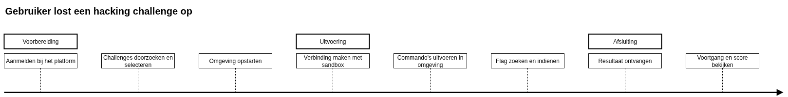
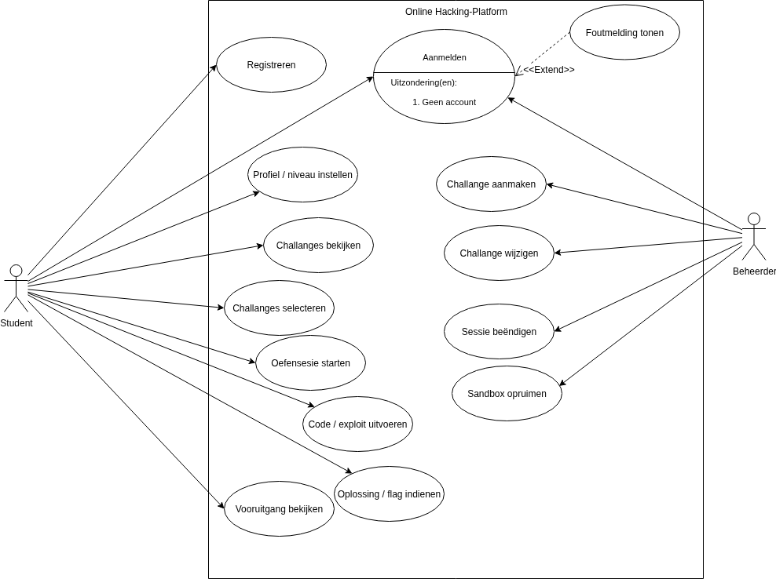
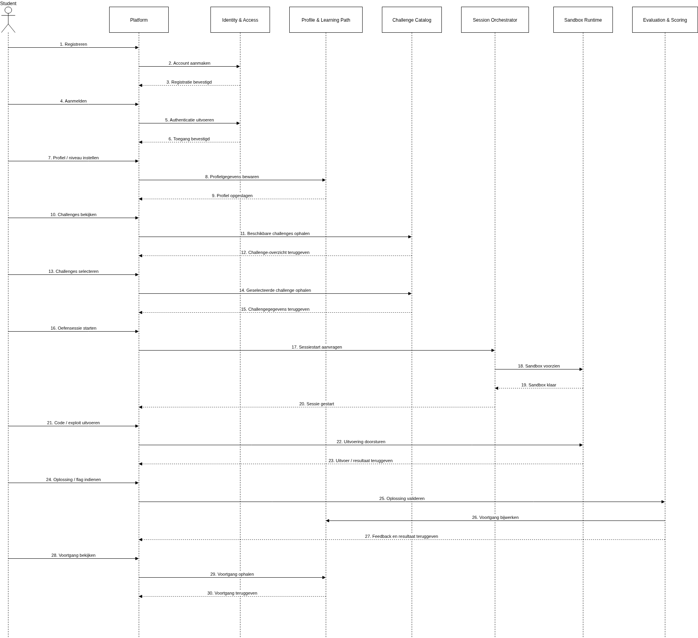
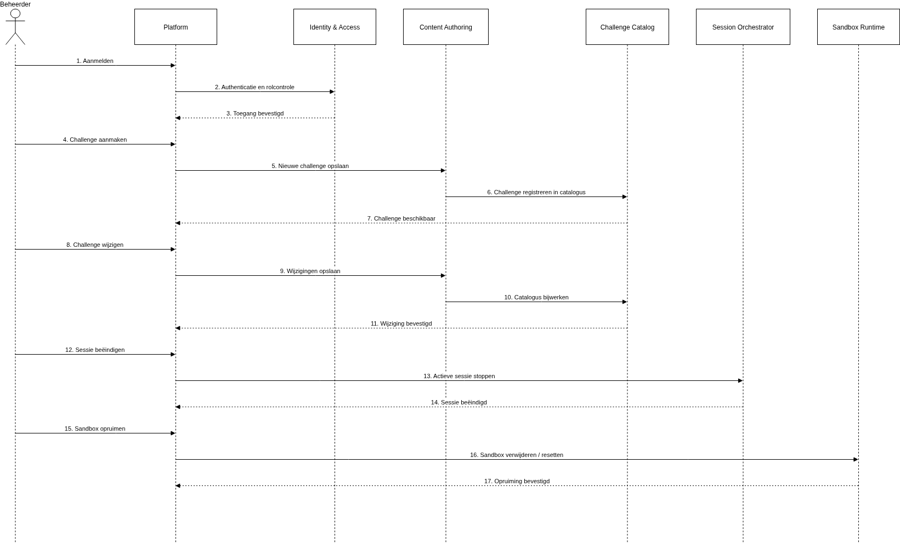
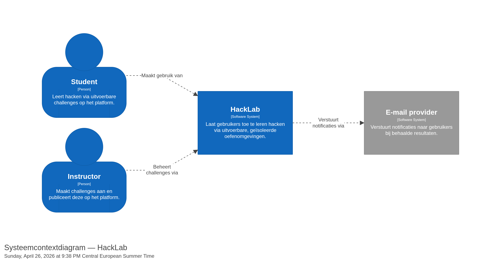
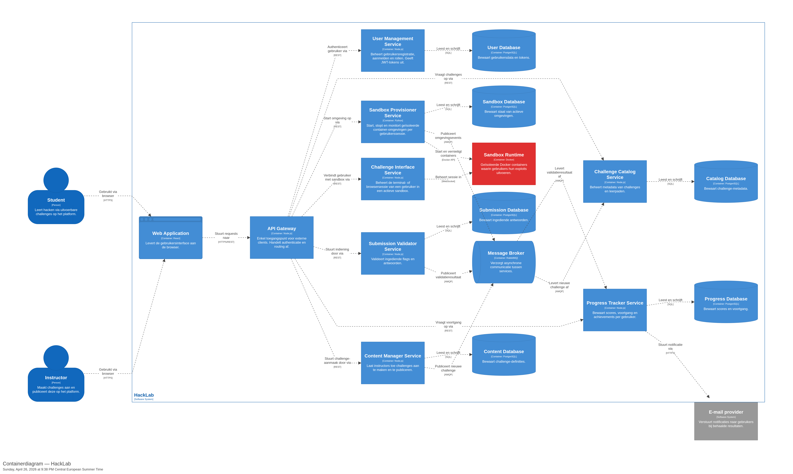
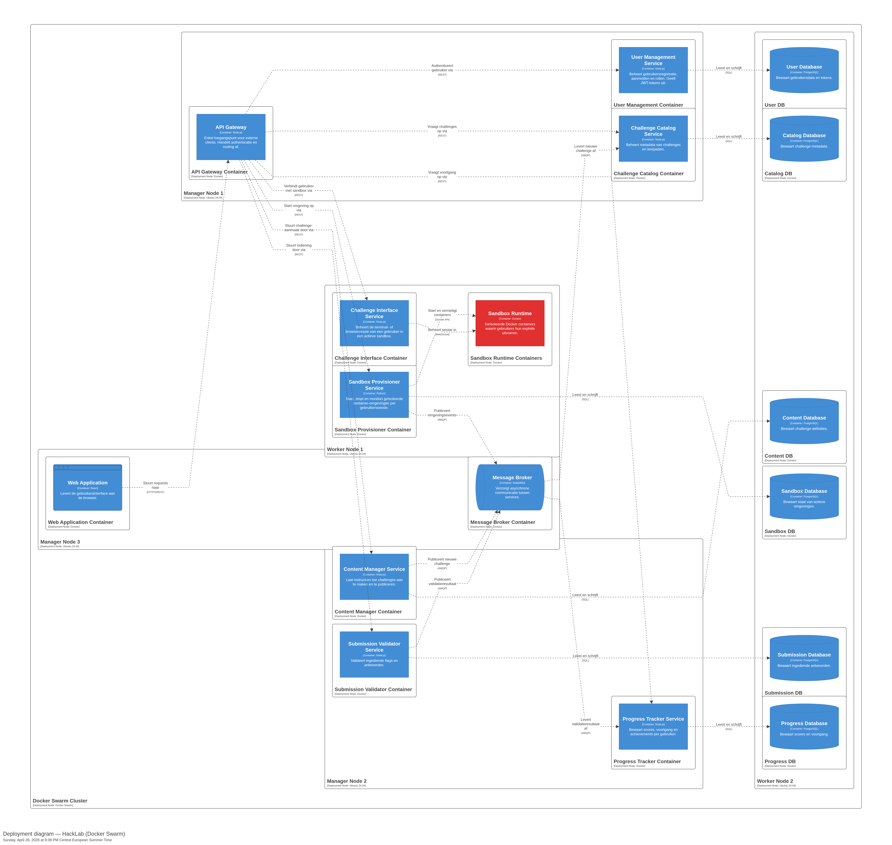

# Karakteristieken

De klant wil een platform waarop gebruikers kunnen leren hacken via
uitvoerbare voorbeelden, vergelijkbaar met TryHackMe. Gebruikers
voeren dus effectief code en exploits uit binnen het systeem. Op
basis hiervan worden de volgende zeven karakteristieken als
belangrijkst beschouwd.

## Security 

Gebruikers voeren echte exploits en aanvalscode uit op het platform.
Een zwakke isolatie tussen oefenomgevingen kan ertoe leiden dat een
gebruiker buiten zijn sandbox geraakt en andere gebruikers, het
platform zelf of de onderliggende infrastructuur schaadt. Security
is bijgevolg de meest kritische karakteristiek van dit systeem: het
is geen optionele toevoeging maar een fundamentele randvoorwaarde
waaraan elk onderdeel van de architectuur moet voldoen.

## Fault Tolerance 

Elke gebruiker werkt in een eigen uitvoerbare omgeving. Als één
oefenomgeving crasht, vastloopt of door een gebruiker opzettelijk
gesaboteerd wordt, mag dit geen invloed hebben op de omgevingen van
andere gebruikers of op de werking van het platform zelf. Fault
tolerance is hier dus niet alleen een kwaliteitskenmerk maar ook een
rechtstreeks gevolg van de aard van het systeem: gebruikers testen
actief de grenzen van omgevingen.

## Scalability 

Een leerplatform voor hacking trekt een breed publiek aan. Elke
actieve gebruiker heeft een eigen geïsoleerde omgeving nodig die
rekenkracht en geheugen verbruikt. Het systeem moet bijgevolg kunnen
meeschalen met het aantal gelijktijdige gebruikers zonder dat de
kwaliteit van de omgevingen achteruitgaat.

## Availability

Gebruikers plannen leersessies en verwachten dat het platform
beschikbaar is wanneer ze het nodig hebben. Uitval van het platform
onderbreekt actieve oefensessies en beschadigt het vertrouwen van
gebruikers. Volledige hoge beschikbaarheid is binnen het budget van
een half jaar met een team van vier niet haalbaar op het niveau van
een grote cloudprovider, maar de architecturale keuzes mogen de
beschikbaarheid niet onnodig beperken.

## Extensibility

De waarde van een hackingplatform zit grotendeels in de breedte en
actualiteit van het aanbod aan uitdagingen. Nieuwe kwetsbaarheden,
technieken en technologieën moeten als nieuwe modules of uitdagingen
aan het systeem kunnen worden toegevoegd zonder dat de kern van het
systeem hiervoor aangepast of heruitgerold moet worden.

## Elasticity

Het gebruik van het platform zal niet constant zijn. Bij het
uitbrengen van nieuwe inhoud, bij georganiseerde CTF-events
(Capture The Flag) of bij schoolperiodes zullen er pieken zijn in
het aantal actieve gebruikers. Het systeem moet tijdelijk kunnen
opschalen en daarna terug afschalen om kosten te beheersen.

## Configurability

Gebruikers hebben uiteenlopende achtergronden en doelstellingen.
Een beginner heeft nood aan begeleide oefeningen met hints, terwijl
een gevorderde gebruiker direct aan complexe scenario's wil werken.
Het systeem moet dit onderscheid kunnen maken en gebruikers in staat
stellen hun eigen leerpad samen te stellen.

# Logische componenten

Het online hackingplatform wordt in deze sectie opgesplitst in logische componenten. Die componenten beschrijven de functionele bouwblokken van het systeem en hun verantwoordelijkheden. Het gaat hier nog niet om services, containers of deployment-eenheden, maar om een logische opdeling van het systeem.

## Tijdlijn van de gebruikersflow

Als vertrekpunt wordt eerst de typische flow van een student bekeken bij het oplossen van een hacking challenge. Die tijdlijn maakt zichtbaar welke stappen doorlopen worden en welke verantwoordelijkheden daaruit voortvloeien.



De flow start wanneer een student zich aanmeldt op het platform. Daarna worden challenges doorzocht en wordt een challenge geselecteerd. Vervolgens wordt een oefenomgeving opgestart en maakt de student verbinding met de sandbox. In die omgeving voert de student commando's, scripts of exploits uit. Daarna wordt een oplossing of flag ingediend, waarna het resultaat wordt teruggegeven en de student zijn voortgang en score kan bekijken.

Deze tijdlijn toont dat de functionaliteit van het systeem uit meerdere duidelijk verschillende taken bestaat. Authenticatie, profielbeheer, challengebeheer, sessiebeheer, sandbox-uitvoering en evaluatie hebben elk een eigen rol binnen het platform.

## Use-case diagram

Het use-case diagram geeft op hoofdlijnen weer welke interacties de student en de beheerder met het platform hebben.



De student gebruikt het platform om zich te registreren of aan te melden, zijn profiel of niveau in te stellen, challenges te bekijken en te selecteren, een oefensessie te starten, code of exploits uit te voeren, een oplossing of flag in te dienen en nadien de voortgang te bekijken.

De beheerder gebruikt het platform om zich aan te melden, challenges aan te maken en te wijzigen, sessies te beëindigen en sandboxen op te ruimen.

Het use-case diagram toont enkel de interacties tussen de actoren en het platform. De interne afhandeling van die acties wordt verder uitgewerkt in de sequence diagrammen.

## Sequence diagram van de student

De interacties van de student worden afzonderlijk weergegeven zodat de volledige leerflow in één samenhangend diagram zichtbaar blijft.



In deze flow registreert en authenticatieert de student zich eerst via het platform. Daarna worden profiel en niveau ingesteld. Vervolgens vraagt de student het challenge-overzicht op, selecteert een challenge en start een oefensessie. Het platform laat daarvoor een sandbox klaarzetten. Tijdens de sessie voert de student code of exploits uit en dient daarna een oplossing of flag in. Ten slotte wordt de oplossing gevalideerd, de voortgang bijgewerkt en de geactualiseerde voortgang opnieuw aan de student getoond.

Dit diagram bevat alle studentacties uit het use-case diagram: registreren, aanmelden, profiel of niveau instellen, challenges bekijken, challenges selecteren, een oefensessie starten, code of exploit uitvoeren, een oplossing of flag indienen en de voortgang bekijken.

## Sequence diagram van de beheerder

De beheerder krijgt een afzonderlijk sequence diagram, omdat deze actor een andere verantwoordelijkheid heeft dan de student en geen leerflow doorloopt.



De beheerder meldt zich eerst aan op het platform. Daarna kan een nieuwe challenge worden aangemaakt of kan een bestaande challenge worden gewijzigd. Deze wijzigingen worden verwerkt en zichtbaar gemaakt in de challengecatalogus. Daarnaast kan de beheerder een actieve sessie beëindigen en een sandbox laten opruimen of resetten.

Ook dit diagram bevat alle beheerderacties uit het use-case diagram: aanmelden, challenge aanmaken, challenge wijzigen, sessie beëindigen en sandbox opruimen.

## Afleiding van de logische componenten

Uit de tijdlijn, het use-case diagram en de sequence diagrammen volgen de logische componenten van het platform. Elke component groepeert taken die inhoudelijk bij elkaar horen en een gezamenlijke verantwoordelijkheid vormen.

### Identity & Access

Deze component behandelt registratie, authenticatie, sessiebeheer en toegangscontrole. Alle interacties rond het identificeren van studenten en beheerders worden hier samengebracht.

### Profile & Learning Path

Deze component beheert profielinformatie, niveau-instellingen, voortgang en het persoonlijke leerpad van een student.

### Challenge Catalog

Deze component ontsluit het beschikbare aanbod aan challenges en levert de informatie die nodig is om challenges te bekijken en te selecteren.

### Session Orchestrator

Deze component beheert de levenscyclus van een oefensessie. Het opstarten en beëindigen van sessies wordt hier ondergebracht.

### Sandbox Runtime

Deze component levert de effectieve uitvoeromgeving waarin een student commando's, scripts en exploits uitvoert. Ook het resetten en opruimen van de omgeving behoort tot deze component.

### Evaluation & Scoring

Deze component valideert oplossingen of flags, bepaalt het resultaat van een challengepoging en ondersteunt de verwerking van feedback en voortgang.

### Content Authoring

Deze component ondersteunt het inhoudelijk beheer van challenges. Het aanmaken en wijzigen van oefenmateriaal wordt hier gegroepeerd.

## Taken per component

### Identity & Access

- Gebruikers registreren.
- Studenten en beheerders authenticeren.
- Toegangscontrole uitvoeren.
- Sessies valideren.

### Profile & Learning Path

- Profielgegevens bewaren.
- Niveau-instellingen beheren.
- Voortgang opslaan.
- Leerstatus teruggeven.

### Challenge Catalog

- Beschikbare challenges tonen.
- Geselecteerde challengegegevens teruggeven.
- De catalogus actualiseren na beheeracties.

### Session Orchestrator

- Oefensessies starten.
- Actieve sessies beëindigen.
- Sandbox-opstart aanvragen.
- Sessiestatus bewaken.

### Sandbox Runtime

- Oefenomgevingen uitvoeren.
- Code en exploits verwerken.
- Uitvoer teruggeven.
- Sandboxen resetten of opruimen.

### Evaluation & Scoring

- Oplossingen en flags valideren.
- Resultaten bepalen.
- Feedback genereren.
- Voortgangsupdates aanleveren.

### Content Authoring

- Challenges aanmaken.
- Bestaande challenges wijzigen.
- Wijzigingen opslaan.
- Inhoud beschikbaar maken voor de catalogus.

## Samenhang van de opdeling

De gekozen opdeling volgt de natuurlijke scheiding tussen toegang, leerinformatie, challengebeheer, sessiebeheer, uitvoering en evaluatie. Daardoor krijgt elke belangrijke taak van het platform een duidelijke plaats binnen het systeem.

De studentflow en de beheerderflow tonen bovendien dat inhoudelijk beheer, uitvoering van challengecode en toegangscontrole niet in éénzelfde component thuishoren. Door die verantwoordelijkheden te scheiden ontstaat een duidelijker en beter verdedigbaar logisch model van het platform.

# ADR Architecturale beslissingen

## Title: ADR 001: Keuze van architecturale stijl
### Status: Proposed

## Context

Het platform laat gebruikers toe echte exploits en aanvalscode uit
te voeren in geïsoleerde oefenomgevingen. De belangrijkste architecturale karakteristieken
zijn security, fault tolerance en scalability. Het ontwikkelteam
telt vier personen en heeft een doorlooptijd van zes maanden voor
een productieklare versie.

De vier stijlen die in overweging genomen worden zijn de stijlen
die in de cursus aan bod zijn gekomen:

| Stijl              | Partitionering | Deployment      |
|--------------------|----------------|-----------------|
| Gelaagd            | Technisch      | Monolitisch     |
| Microkernel        | Technisch      | Monolitisch     |
| Modulaire monoliet | Domein         | Monolitisch     |
| Microservices      | Domein         | Gedistribueerd  |

Elke stijl wordt geëvalueerd op basis van de impact op de belangrijkste karakteristieken.

## Decision

**We kiezen voor microservices.**

Deze keuze wordt gemaakt omdat de drie belangrijkste karakteristieken 
(security, fault tolerance en scalability) vereisen dat kritieke
onderdelen, zoals de Sandbox Provisioner, onafhankelijk
kunnen opereren, schalen en falen zonder impact op anderen delen van het systeem.

Microservices bieden deze isolatie en onafhankelijkheid structureel, 
terwijl monolitische stijlen dit niet kunnen garanderen.

Als het team groter of het budget hoger zou zijn, zou de keuze
voor microservices nog sterker worden ondersteund door de
mogelijkheid tot teamautonomie per service. Als het team kleiner
of het budget lager zou zijn, zou de modulaire monoliet de tweede
keuze zijn: de grenzen tussen de logische componenten zijn al
vastgelegd en een latere migratie naar microservices is vanaf
een modulaire monoliet haalbaarder dan vanuit een gelaagde
architectuur.

## Consequences

**Wat wordt mogelijk:**
- Services kunnen onafhankelijk worden opgeschaald (vooral Sandbox Provisioner)
- Fouten in één service beïnvloeden andere services niet
- Services kunnen afzonderlijk worden ontwikkeld, getest en gedeployed
- Mogelijkheid om per service technologiekeuzes te maken

**Wat wordt moeilijker of vereist extra werk:**
- Complexere communicatie tussen services (netwerk, latency)
- Data ownership moet expliciet worden vastgelegd
- Observability en monitoring vereisen extra tooling
- Gedistribueerde systemen verhogen de complexiteit van debugging en testing

## Governance

Bij elke nieuwe feature wordt gecontroleerd of de service-grenzen
gerespecteerd worden: geen directe database-toegang over
service-grenzen heen. Dit wordt bewaakt via code review. Elke
nieuwe service vereist een bijkomende ADR die de
verantwoordelijkheid en de communicatie-interfaces vastlegt.
Communicatiepatronen worden vastgelegd volgens ADR 002.

## Notes

**Tweede keuze: Modulaire monoliet.**
Deze stijl sluit goed aan bij de domein-gebaseerde componenten 
en is eenvoudiger te implementeren binnen een klein team.
De keuze voor microservices wordt echter gerechtvaardigd 
door de hogere eisen op vlak van security, fault tolerance 
en scalability.

## Title: ADR 002: Communicatie tussen services
### Status: Proposed

## Context

De microservices uit sectie 3 moeten met elkaar communiceren.
Er zijn twee fundamentele opties: synchrone communicatie via
HTTP/REST waarbij de aanroeper wacht op een antwoord, en
asynchrone communicatie via een message broker waarbij de
aanroeper een bericht plaatst en verder werkt zonder te wachten.

De communicatiepatronen tussen de logische componenten uit
sectie 2 zijn niet allemaal van hetzelfde type:

- Een student vraagt een challenge op uit de catalog → de UI
  wacht op een antwoord (tijdskritisch)
- Een student dient een flag in => de Submission Validator
  verwerkt dit en de Progress Tracker moet worden bijgewerkt,
  maar de student hoeft niet te wachten tot de score
  opgeslagen is om zijn resultaat te zien
- De Sandbox Provisioner meldt dat een omgeving gecrasht is
  => andere services hoeven hier niet op te wachten maar
  moeten wel verwittigd worden

## Decision

**Er wordt gekozen voor een hybride communicatiemodel:**
- **Synchrone communicatie (REST over HTTP)** voor tijdskritische 
interacties waarbij een onmiddelijk antwoord vereist is
- **Asynchrone communicatie (via een message broker)** voor events 
waarbij de aanroeper niet hoeft te wachten op verwerking

Concrete toepassing:
- Student <=> Challenge Catalog: synchroon
- Student <=> Sandbox Provisioner (opstarten): synchroon
- Student <=> Challenge Interface: synchroon
- Submission Validator => Progress Tracker: asynchroon
- Sandbox Provisioner => andere services (crash, stop): asynchroon
- Content Manager => Challenge Catalog (publicatie): asynchroon

Als het team groter of het budget hoger zou zijn, zou een
API gateway als enkel synchrone toegangspoort voor externe
clients worden toegevoegd, wat authenticatie en rate limiting
centraliseert. Bij een kleiner team zou volledig synchrone
communicatie eenvoudiger te beheren zijn, maar dit gaat ten
koste van fault tolerance.

## Consequences

**Wat wordt mogelijk:**
- Services zijn minder afhankelijk van elkaar bij 
asynchrone communicatie
- Tijdskritische interacties blijven snel en voorspelbaar
- Het systeem is beter bestand tegen tijdelijke uitval van services
- Verwerking kan schaalbaar gebeuren via event-based flows

**Wat extra werk vereist:**
- Infrastructuur voor een message broker moet voorzien worden
- Asynchrone flows zijn moeilijker te debuggen en te testen
- Eventual consistency moet expliciet aanvaard worden
- Complexiteit in foutafhandeling en retries

## Governance

Bij elke nieuwe communicatielijn tussen services wordt in
code review gecontroleerd of de keuze synchroon/asynchroon
gemotiveerd is. Nieuwe asynchrone verbindingen worden
gedocumenteerd in een berichtenoverzicht. Nieuwe messaging-patronen vereisen 
een bijkomende ADR indien ze impact hebben op meerdere services.

## Notes

Deze beslissing ondersteunt de karakteristieken **fault tolerance** en **scalability**, 
zoals gedefinieerd in sectie 1. Als het team groter of het budget hoger zou zijn, 
kan een API gateway toegevoegd worden als centrale toegangspoort voor externe clients. 
Dit zou authenticatie, logging en rate limiting centraliseren. 
Bij een kleiner team of eenvoudiger systeem zou een volledig synchrone aanpak 
eenvoudiger zijn, maar dit gaat ten koste van robuustheid en schaalbaarheid.

## Title: ADR 003: Data ownership per service
### Status: Proposed

## Context

Binnen een microservices-architectuur moeten services omgaan 
met dataopslag. Een mogelijke aanpak is het gebruik van één 
gedeelde databank voor alle services. Dit vereenvoudigt queries 
en vermijdt dataduplicatie, maar introduceert sterke koppeling 
tussen services: wijzigingen aan het databankschema kunnen 
meerdere services tegelijk breken.

De logische componenten in dit systeem zijn duidelijk afgebakend 
per domein (bijv. gebruikersbeheer, challenges, voortgang). Dit 
roept de vraag op of deze componenten een gedeelde databank moeten 
gebruiken of elk hun eigen dataschema moeten beheren.

Daarnaast vereisen de karakteristieken **scalability, fault tolerance 
en maintainability** dat services zo onafhankelijk mogelijk 
kunnen evolueren en deployen.

## Decision

Elke service beheert zijn **eigen dataschema**. Geen enkele service
leest of schrijft rechtstreeks naar het schema van een ander service.

Data-uitwisseling tussen services gebeurt uitsluitend via de 
communicatiekanalen zoals gedefinieerd in ADR 002, en niet 
via gedeelde databanktables.

Concreet betekent dit:
- User Management beheert het gebruikersschema
- Challenge Catalog beheert de challenge-metadata
- Sandbox Provisioner beheert de staat van actieve omgevingen
- Submission Validator beheert de ingediende antwoorden
- Progress Tracker beheert scores en voortgang per gebruiker
- Content Manager beheert de ruwe challenge-definities

Als implementatiekeuze worden deze schema's ondergebracht op 
één fysieke databaseserver, met strikte scheiding per service.
Toegang tot data verloopt uitsluitend via de respectieve service-API.

## Consequences

**Wat wordt mogelijk:**
- Services kunnen onafhankelijk evolueren zonder impact op andere services
- Services zijn onafhankelijk testbaar en deploybaar
- Data ownership is expliciet en duidelijk per domein
- Schemawijzigingen zijn lokaal en beheersbaar

**Wat extra werk vereist:**
- JOIN-queries over servicegrenzen zijn niet mogelijk
- Data moet soms gedupliceerd worden tussen services
- Eventual consistency moet aanvaard worden bij asynchrone updates
- Composities van data moeten in applicatielogica gebeuren

## Governance

Code review controleert dat geen enkele service rechtstreeks
een tabel van een andere service aanroept. Dit wordt ook
bewaakt via netwerkconfiguratie: services krijgen enkel
toegang tot hun eigen schema. Nieuwe data-afhankelijkheden 
moeten via API's of events verlopen. Wijzigingen in datastructuren 
worden gedocumenteerd en kunnen aanleiding geven tot een nieuwe ADR.

## Notes

Deze beslissing ondersteunt de karakteristieken **scalability, 
fault tolerance en maintainability** door sterke koppeling 
tussen services te vermijden. Bij een groter budget of complexer 
systeem zou elke service een eigen fysieke database-instantie krijgen. 
In de huidige context (team van vier, beperkte scope) is een 
gedeelde databaseserver met gescheiden schema’s een pragmatisch compromis.

## Title: ADR 004: Isolatie van sandbox-omgevingen
### Status: Proposed

## Context

Gebruikers van het platform voeren echte exploits en aanvalscode 
uit binnen oefeningomgevingen. Dit brengt een hoog veiligheidsrisico 
met zich mee: een onvoldoende geïsoleerde omgeving kan leiden 
tot toegang tot andere gebruikersomgevingen of tot de onderliggende 
infrastructuur.

De isolatie van sandbox-omgevingen is daarom een kritische 
architecturale beslissing die rechtstreeks impact heeft op 
de karakteristieken **security** en **fault tolerance**.

Er zijn drie mogelijke benaderingen voor isolatie:
- **Procesisolatie**: uitvoering als aparte processen op de 
host, geïsoleerd via OS-mechanismen
- **Containerisolatie**: uitvoering binnen containers (bijv. Docker)
- **VM-isolatie**: uitvoering binnen volledige virtuele machines

Elke benadering biedt een verschillend niveau van isolatie, 
performantie en operationele complexiteit.

## Decision

**Sandbox-omgevingen worden geïsoleerd via containerisolatie (Docker),
aangestuurd door de Sandbox Provisioner.**

Deze keuze wordt gemaakt omdat containerisolatie een evenwicht biedt tussen:
- voldoende sterke isolatie voor het uirvoeren van onbetrouwbare code
- snelle opstarttijden (seconden in plaats van minuten)
- beheersbaarheid binnen de beperkingen van een klein team

Elke gebruikssessie krijgt een tijdelijke, geïsoleerde container 
die na gebruik automatisch wordt beëindigd en verwijderd.

Containers worden uitgevoerd met minimale rechten:
- geen privileged mode
- beperkte CPU- en geheugentoewijzing
- gecontroleerde netwerktoegang
- geen directe toegang tot host resources

## Consequences

**Wat wordt mogelijk:**
- Gebruikersomgevingen zijn logisch en technisch geïsoleerd van elkaar
- Omgevingen kunnen snel en dynamisch worden opgestart
- De Sandbox Provisioner kan omgevingen automatisch beheren (start/stop/herstel)
- Resourcegebruik kan per container gecontroleerd worden

**Wat extra werk vereist:**
- Containerisolatie biedt minder sterke garanties dan volledige VM-isolatie
- Foute configuratie kan leiden tot container escapes
- Extra aandacht vereist voor beveiliging van de hostomgeving
- Security-configuratie vraagt expliciete validatie en testing

## Governance

Elke aanpassing aan de container-configuratie van de Sandbox
Provisioner vereist expliciete goedkeuring via code review.
De configuratie wordt bijgehouden in versiebeheer. Er worden
geen privileged containers toegestaan zonder een nieuwe ADR.
Security-instellingen worden expliciet getest binnen POC 1 (Container Isolation).

## Notes

Deze beslissing ondersteunt primair de karakteristiek security, 
en in tweede instantie fault tolerance doordat falende 
of gecompromitteerde omgevingen geïsoleerd blijven.
Bij een groter budget of strengere security-eisen zou 
VM-gebaseerde isolatie (bijv. Firecracker) overwogen worden 
om sterkere isolatiegaranties te bieden. De haalbaarheid 
van deze keuze wordt gevalideerd in POC 1.

## Title: ADR 005: Authenticatie en autorisatie
### Status: Proposed

## Context

Het platform ondersteunt meerdere types gebruikers met verschillende 
rechten, zoals studenten, instructors en beheerders. Elke 
service moet kunnen bepalen wie een request uitvoert en of deze 
gebruiker gemachtigd is om de gevraagde actie uit te voeren.

Binnen een microservices-architectuur zijn er twee mogelijke benaderingen:
- **Gedistribueerde aanpak**: elke service beheert authenticatie en 
  autorisatie zelfstandig
- **Centrale aanpak**: één service verzorgt authenticatie en
  geeft tokens uit die door andere services gevalideerd worden

De keuze moet rekening houden met de karakteristieken security, 
scalability en availability, en moet vermijden dat een centrale 
component een bottleneck of single point of failure wordt.

## Decision

Er wordt gekozen voor een **hybride aanpak**:
- Een centrale authenticatieservice (User Management) verzorgt de uitgifte van tokens
- Elke service valideert tokens lokaal zonder de authenticatieservice 
  opnieuw te contacteren

Authenticatie gebeurt via JWT. Tokens bevatten gebruikersinformatie 
en rollen, en worden ondertekend met een private sleutel. Services 
valideren tokens aan de hand van de bijhorende publieke sleutel.

Autorisatie gebeurt op basis van rollen die in het token zijn opgenomen. 
Elke service bepaalt zelf of een gebruiker voldoende rechten heeft 
voor een bepaalde actie.

Deze aanpak combineert centrale controle over identiteit met 
gedistribueerde validatie, waardoor afhankelijkheid van één 
service tijdens runtime wordt vermeden.

## Consequences

**Wat wordt mogelijk:**
- Geen centrale bottleneck of SPF bij elke request
- Services blijven operationeel zonder directe afhankelijkheid
  van de authenticatieservice
- Authenticatie-informatie is direct beschikbaar in het token
- Schaalbaarheid wordt ondersteund doordat validatie lokaal gebeurt

**Wat extra werk vereist:**
- Token-expiratie en refresh-mechanismen moeten correct 
  worden geïmplementeerd
- Intrekken van tokens voor expiratie is complex
- Sleutelbeheer vereist coördinatie
- Elke service moet correct omgaan met tokenvalidatie en autorisatie

## Governance

Tokenvalidatie wordt niet gedupliceerd per service maar
geïmplementeerd als gedeelde bibliotheek. Wijzigingen aan
het tokenformaat of de sleutelrotatie vereisen coördinatie
over alle services en een nieuwe ADR. Code reviews controleren 
correcte implementatie van authenticatie en autorisatie.

## Notes

Deze beslissing ondersteunt primair de karakteristiek security, 
en draagt bij aan scalability en availability door het 
vermijden van een centrale afhankelijkheid tijdens runtime.

Bij een groter team of complexere omgeving zou een externe 
identity provider (bijv. Keycloak) overwogen worden om 
authenticatie en autorisatie verder te standaardiseren.

De haalbaarheid van deze beslissing wordt gevalideerd in POC 3 (Authentication & User Progress).

# C4-diagrammen

De diagrammen zijn opgesteld volgens het C4-model en gegenereerd
via Structurizr. De broncode hieronder is de enige bron van
waarheid voor de diagrammen. De geëxporteerde PNG's zijn
opgenomen via relatieve paden.

## Broncode

```structurizr
workspace "HackLab" "Leerplatform voor hacking via uitvoerbare voorbeelden" {

    model {

        # Externe actoren
        student = person "Student" "Leert hacken via uitvoerbare challenges op het platform."
        instructor = person "Instructor" "Maakt challenges aan en publiceert deze op het platform."

        # Extern systeem
        emailProvider = softwareSystem "E-mail provider" "Verstuurt notificaties naar gebruikers bij behaalde resultaten." "External"

        # Het systeem zelf
        hacklab = softwareSystem "HackLab" "Laat gebruikers toe te leren hacken via uitvoerbare, geïsoleerde oefenomgevingen." {

            # Containers
            webApp = container "Web Application" "Levert de gebruikersinterface aan de browser." "React" "Web"

            apiGateway = container "API Gateway" "Enkel toegangspunt voor externe clients. Handelt authenticatie en routing af." "Node.js"

            userManagement = container "User Management Service" "Beheert gebruikersregistratie, aanmelden en rollen. Geeft JWT-tokens uit." "Node.js"

            challengeCatalog = container "Challenge Catalog Service" "Beheert metadata van challenges en leerpaden." "Node.js"

            contentManager = container "Content Manager Service" "Laat instructors toe challenges aan te maken en te publiceren." "Node.js"

            sandboxProvisioner = container "Sandbox Provisioner Service" "Start, stopt en monitort geïsoleerde container-omgevingen per gebruikerssessie." "Python"

            challengeInterface = container "Challenge Interface Service" "Beheert de terminal- of browsersessie van een gebruiker in een actieve sandbox." "Node.js"

            submissionValidator = container "Submission Validator Service" "Valideert ingediende flags en antwoorden." "Node.js"

            progressTracker = container "Progress Tracker Service" "Bewaart scores, voortgang en achievements per gebruiker." "Node.js"

            messageBroker = container "Message Broker" "Verzorgt asynchrone communicatie tussen services." "RabbitMQ" "Queue"

            # Databases
            userDb = container "User Database" "Bewaart gebruikersdata en tokens." "PostgreSQL" "Database"
            catalogDb = container "Catalog Database" "Bewaart challenge-metadata." "PostgreSQL" "Database"
            contentDb = container "Content Database" "Bewaart challenge-definities." "PostgreSQL" "Database"
            sandboxDb = container "Sandbox Database" "Bewaart staat van actieve omgevingen." "PostgreSQL" "Database"
            submissionDb = container "Submission Database" "Bewaart ingediende antwoorden." "PostgreSQL" "Database"
            progressDb = container "Progress Database" "Bewaart scores en voortgang." "PostgreSQL" "Database"

            # Sandbox omgevingen
            sandboxRuntime = container "Sandbox Runtime" "Geïsoleerde Docker containers waarin gebruikers hun exploits uitvoeren." "Docker" "Sandbox"
        }

        # Relaties: externe actoren met systeem
        student -> hacklab "Maakt gebruik van"
        instructor -> hacklab "Beheert challenges via"
        hacklab -> emailProvider "Verstuurt notificaties via"

        # Relaties: actoren met containers
        student -> webApp "Gebruikt via browser" "HTTPS"
        instructor -> webApp "Gebruikt via browser" "HTTPS"
        webApp -> apiGateway "Stuurt requests naar" "HTTPS/REST"

        # Relaties: API Gateway naar services (synchroon)
        apiGateway -> userManagement "Authenticeert gebruiker via" "REST"
        apiGateway -> challengeCatalog "Vraagt challenges op via" "REST"
        apiGateway -> sandboxProvisioner "Start omgeving op via" "REST"
        apiGateway -> challengeInterface "Verbindt gebruiker met sandbox via" "REST"
        apiGateway -> submissionValidator "Stuurt indiening door via" "REST"
        apiGateway -> progressTracker "Vraagt voortgang op via" "REST"
        apiGateway -> contentManager "Stuurt challenge-aanmaak door via" "REST"

        # Relaties: services naar databases
        userManagement -> userDb "Leest en schrijft" "SQL"
        challengeCatalog -> catalogDb "Leest en schrijft" "SQL"
        contentManager -> contentDb "Leest en schrijft" "SQL"
        sandboxProvisioner -> sandboxDb "Leest en schrijft" "SQL"
        submissionValidator -> submissionDb "Leest en schrijft" "SQL"
        progressTracker -> progressDb "Leest en schrijft" "SQL"

        # Relaties: asynchroon via message broker
        submissionValidator -> messageBroker "Publiceert validatieresultaat" "AMQP"
        messageBroker -> progressTracker "Levert validatieresultaat af" "AMQP"
        contentManager -> messageBroker "Publiceert nieuwe challenge" "AMQP"
        messageBroker -> challengeCatalog "Levert nieuwe challenge af" "AMQP"
        sandboxProvisioner -> messageBroker "Publiceert omgevingsevents" "AMQP"

        # Relaties: sandbox
        sandboxProvisioner -> sandboxRuntime "Start en vernietigt containers" "Docker API"
        challengeInterface -> sandboxRuntime "Beheert sessie in" "WebSocket"

        # Relaties: extern
        progressTracker -> emailProvider "Stuurt notificatie via" "HTTPS"

        # Deployment
        deploymentEnvironment "Production" {

            deploymentNode "Docker Swarm Cluster" "Testcluster met drie managers en twee workers." "Docker Swarm" {

                deploymentNode "Manager Node 1" "Swarm manager — beheert de cluster." "Ubuntu 24.04" {
                    deploymentNode "API Gateway Container" "" "Docker" {
                        containerInstance apiGateway
                    }
                    deploymentNode "User Management Container" "" "Docker" {
                        containerInstance userManagement
                    }
                    deploymentNode "Challenge Catalog Container" "" "Docker" {
                        containerInstance challengeCatalog
                    }
                }

                deploymentNode "Manager Node 2" "Swarm manager." "Ubuntu 24.04" {
                    deploymentNode "Content Manager Container" "" "Docker" {
                        containerInstance contentManager
                    }
                    deploymentNode "Submission Validator Container" "" "Docker" {
                        containerInstance submissionValidator
                    }
                    deploymentNode "Progress Tracker Container" "" "Docker" {
                        containerInstance progressTracker
                    }
                }

                deploymentNode "Manager Node 3" "Swarm manager." "Ubuntu 24.04" {
                    deploymentNode "Message Broker Container" "" "Docker" {
                        containerInstance messageBroker
                    }
                    deploymentNode "Web Application Container" "" "Docker" {
                        containerInstance webApp
                    }
                }

                deploymentNode "Worker Node 1" "Swarm worker — draait sandbox-omgevingen." "Ubuntu 24.04" {
                    deploymentNode "Sandbox Provisioner Container" "" "Docker" {
                        containerInstance sandboxProvisioner
                    }
                    deploymentNode "Challenge Interface Container" "" "Docker" {
                        containerInstance challengeInterface
                    }
                    deploymentNode "Sandbox Runtime Containers" "Dynamisch aangemaakte containers per gebruikerssessie." "Docker" {
                        containerInstance sandboxRuntime
                    }
                }

                deploymentNode "Worker Node 2" "Swarm worker — draait databases." "Ubuntu 24.04" {
                    deploymentNode "User DB" "" "Docker" {
                        containerInstance userDb
                    }
                    deploymentNode "Catalog DB" "" "Docker" {
                        containerInstance catalogDb
                    }
                    deploymentNode "Content DB" "" "Docker" {
                        containerInstance contentDb
                    }
                    deploymentNode "Sandbox DB" "" "Docker" {
                        containerInstance sandboxDb
                    }
                    deploymentNode "Submission DB" "" "Docker" {
                        containerInstance submissionDb
                    }
                    deploymentNode "Progress DB" "" "Docker" {
                        containerInstance progressDb
                    }
                }
            }
        }
    }

    views {

        systemContext hacklab "SystemContext" {
            include *
            autolayout lr
            title "Systeemcontextdiagram — HackLab"
        }

        container hacklab "Containers" {
            include *
            autolayout lr
            title "Containerdiagram — HackLab"
        }

        deployment hacklab "Production" "Deployment" {
            include *
            autolayout lr
            title "Deployment diagram — HackLab (Docker Swarm)"
        }

        styles {
            element "Person" {
                shape Person
                background #1168bd
                color #ffffff
            }
            element "Software System" {
                background #1168bd
                color #ffffff
            }
            element "External" {
                background #999999
                color #ffffff
            }
            element "Container" {
                background #438dd5
                color #ffffff
            }
            element "Database" {
                shape Cylinder
                background #438dd5
                color #ffffff
            }
            element "Queue" {
                shape Pipe
                background #438dd5
                color #ffffff
            }
            element "Web" {
                shape WebBrowser
                background #438dd5
                color #ffffff
            }
            element "Sandbox" {
                background #e03030
                color #ffffff
            }
        }
    }
}
```

## Systeemcontextdiagram



Het systeemcontextdiagram toont de twee gebruikerstypen, Student
en Instructor en hun relatie met het HackLab-systeem als geheel.
Een externe e-mailprovider wordt aangesproken voor notificaties.

## Containerdiagram



Het containerdiagram toont de afzonderlijk deploybare services,
hun onderlinge communicatie en de databanken die elk beheren.
De API Gateway is het enige synchrone toegangspunt voor de
Web Application. Asynchrone communicatie verloopt via de
Message Broker. De Sandbox Runtime is rood gemarkeerd omdat
deze de veiligheidsgrens van het systeem vormt.

## Deployment diagram



Het deployment diagram toont de verdeling over de Docker Swarm
testcluster van drie managers en twee workers. Worker Node 1
draait uitsluitend de sandbox-gerelateerde containers omdat
deze het zwaarst belast worden en de grootste veiligheidsrisico's
vormen. Worker Node 2 draait uitsluitend de databases.

